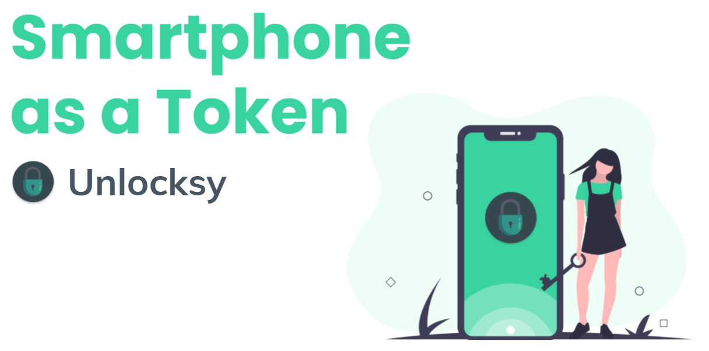

  

  

   

  

  

  

  

<h1>Unlocksy | IST</h1>

A system that allows users to use their smartphone to authenticate themselves to a computer via Bluetooth. The smartphone works as a token allowing users to have access to some folders if they have permission for them. The user can also enable the proximity feature and besides needing to have the required permission for the folders, it will also need to be near the computer to have access to them.

# Developers

Project developed for Network and Computer Security course of IST by:

<table>
  <tr>
    <td align="center"><a href="https://github.com/joanasesinando"> <b>Joana Sesinando</b></td>
    <td align="center"><a href="https://github.com/bernardocmarques"> <b>Bernardo Marques</b></td>
    <td align="center"><a href="https://github.com/esteveste"> <b>Bernardo Esteves</b></td>
  </tr>
</table>
